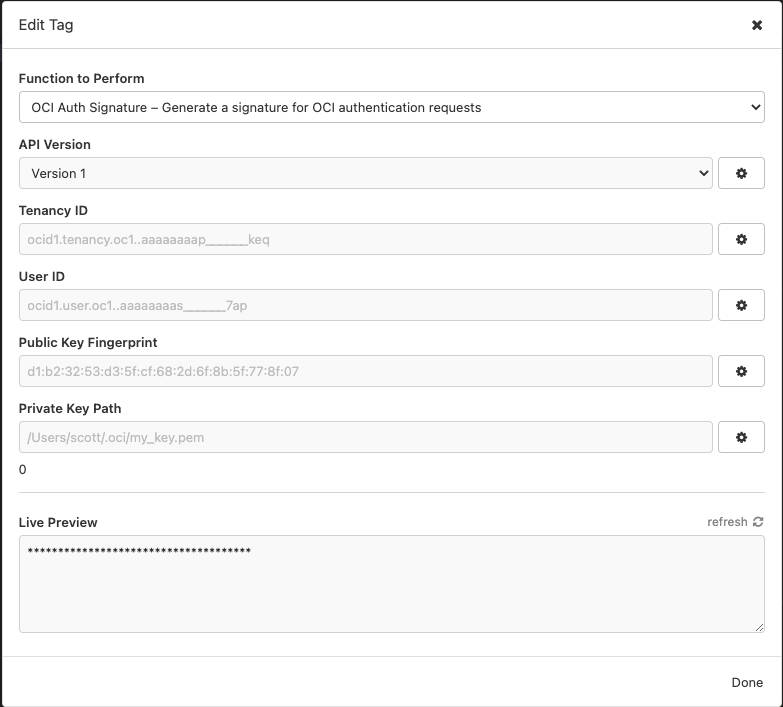

# OCI Request Signature Insomnia Plugin

 

This plugin will [generate a signature](https://docs.oracle.com/en-us/iaas/Content/API/Concepts/signingrequests.htm) for the `Authorization` header in Oracle Cloud Infrastructure REST API requests.

## Pre-Requisites

- The [Insomnia REST](https://insomnia.rest) client.

## Installation

### Insomnia Plugin Manager

1. Open Insomnia
2. Open the application preferences
3. Enter `insomnia-plugin-oci-auth` and click "install plugin"

4. Close the plugins dialog

### Manual Installation

1. Navigate to the plugins directory on your machine
2. Clone this repository into the directory
3. Open the Makefile and update the `extensions_dir` variable with the path to the Insomnia extensions directory on your system.
4. Run `make install` from your shell.
5. In Insomnia's menu, click `Tools` > `Reload Plugins`

## Usage

The plugin should always be used as a tag template for the `Authorization` header in a request to an OCI REST endpoint.  The plugin requires the same inputs as the OCI CLI or other tools that leverage OCI REST APIs.  You will only be able to make requests to endpoints that your user account has permissions to access.

- OCI Tenancy ID
- OCI User ID
- The fingerprint of the public key associated with your OCI user id
- The path on your local system to the private key that is associated with the public key in the previous step
  - This must be an absolute path to the location of the key and the key must be readable by your user account

These entries can be set via environment variables so that you can control settings for different accounts, tenancies, or compartments.

You may set `date` or `x-date` headers within the request, but the extension will do this automatically for you so it is ok to omit them.  Also, the extension will calculate the `x-content-sha256` header and apply it to `POST`, `PATCH`, and `PUT` requests as required by the signature requirements.  So, this should be the only header that you need to use for generating the OCI signature.  The signature is generated at request-time, so you will not see a preview of the signature in the plugin configuration window.

## Future Improvements

- Add different language support for text output.
- Properly type Insomnia objects.
